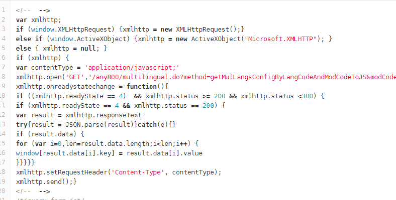
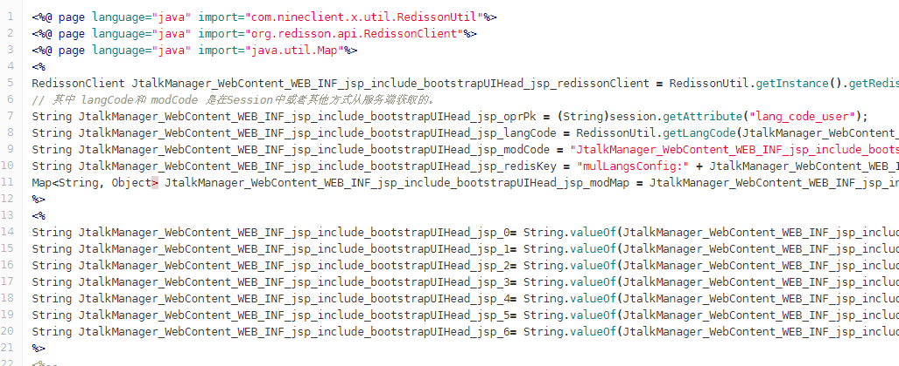

# ucc后台
开发框架: jquery.1.7.2.min.js  
样例: [http://git.any800.com/goldeneasysale/any800 ](http://git.any800.com/goldeneasysale/any800) develop分支  
目录: JtalkManager  
代码路径:JtalkManager\WebContent\  

## 自开发UI框架
1. 版本1.0 html驱动框架 (已放弃使用)  
 
使用jquery框架开发,以html驱动  
通过预加载html,对不同的html对象解析类型  

##### 代码路径: 
/JtalkManager/WebContent/bootstrapUI/(js,img,fonts,css)
##### 访问入口文件: 
/JtalkManager/WebContent/WEB-INF/jsp/include/bootstrapUIHead.jsp
##### 入口js: 
/JtalkManager/WebContent/bootstrapUI/js/tool/loadJq.js
##### 测试地址: 
[http://120.55.94.29/demo/site/mike/bootdemo/index.html](http://120.55.94.29/demo/site/mike/bootdemo/index.html)

2. 版本2.0 js驱动框架  

使用jquery框架开发,以js驱动  
通过ajax加载js,css,impl(模板文件)  
通过配置参数,异步加载预需要使用的组件与插件  
针对每个组件,进行插件二次开发  

##### 代码路径: 
/JtalkManager/WebContent/bootstrapUI/toolbox
##### 访问入口文件:
/JtalkManager/WebContent/WEB-INF/jsp/include/mvcHead.jsp
##### 入口js: 
/JtalkManager/WebContent/bootstrapUI/toolbox/main/ncMain.js
##### 测试地址: 
[http://120.55.94.29/demo/site/mike/mvvmjs/demo.html](http://120.55.94.29/demo/site/mike/mvvmjs/demo.html)

3. 版本3.0 多语言
多语言版本加载分为jsp和js  
js通过xhr请求在调用jquery前就需要加载  
  
jsp通过redis方法从服务器中访问  
  

#### 目录结构
/JtalkManager/WebContent/bootstrapUI

- bootstrapUI
  - any800
  - css                     样式 按照jsp页面分离单独目录
  - fonts                   glyphicons 样式字体
  - img                     图片 按照jsp页面分离单独目录
  - js
    - datetimepicker        时间组件
    - fancytree             树组件
    - running               启动js 按照jsp页面分离单独目录
    - tableFomat            (未知用途)
    - tool                  html驱动框架
  - toolbox                 js驱动框架
    - component             基础组件
      - [单独组件]          
        - js                关联js
        - images            图片
        - impl              组件模板(impl语句)
        - css               组件关联样式
        - init.js           组件的初始化
    - main                  加载核心
      - ncMain.js           核心代码,解析组件和插件,并进行相应的加载,初始化定义部分全局方法
    - pluginCenter          合成插件
      - [合成插件]
        - js                关联js
        - images            图片
        - impl              组件模板(impl语句)
        - css               组件关联样式
        - init.js           组件的初始化
  - webuploader             上传文件

#### 组件init.js说明
```javascript
NCLIENTINPUT.prototype = {
  //是否初始化
  isInit:false,
  //初始化组件,加载目录中的js,css,impl文件
  init:function(){
    var defered = new $.Deferred();
    $.when(
      $.ajaxCss("/css/ncinput.css",this.options.dir),
      $.ajaxImpl("/impl/nClientinput.impl","nClientinput",this.options.dir)
    ).done(function(){
      defered.resolve();
    })
    this.isInit = true;
    return defered.promise();
  },
  //启动组件
  start:function(){
    var dfd = new $.Deferred();
    if(!this.isInit){
      this.init().done(function(){
        dfd.resolve(this);
      });
      return dfd.promise(this);
    }else{
      return dfd.resolve(this);
    }
  },
  //创建组件, 将impl文件使用tmpl解析并挂载在html上,访问当前对象,并对当前的dom节点做事件绑定
  create:function(el){
    var e = $("#nClientinput").tmpl(el).appendTo(el.target);
    var $this = $(e).find("input");
    if(!!el.popover)this.popover($this,el.popover);
    e.on('getValue', function(event,fn) {
      fn.call(this,$(this).find("input").val().replace(/\'/g,"\\'"));
    });
    e.on('setValue', function(event,value) {
      return $(this).find("input").val(value);
    });
    e.on('clearValue', function(event) {
      return $(this).find("input").val("");
    });
    e.on('toggleDisabled', function(event,json,fn) {
      if(json == true){
        $this.removeAttr("disabled")
      }else{
        $this.attr("disabled","disabled")
      }
    });
    return e;
  },
}
```