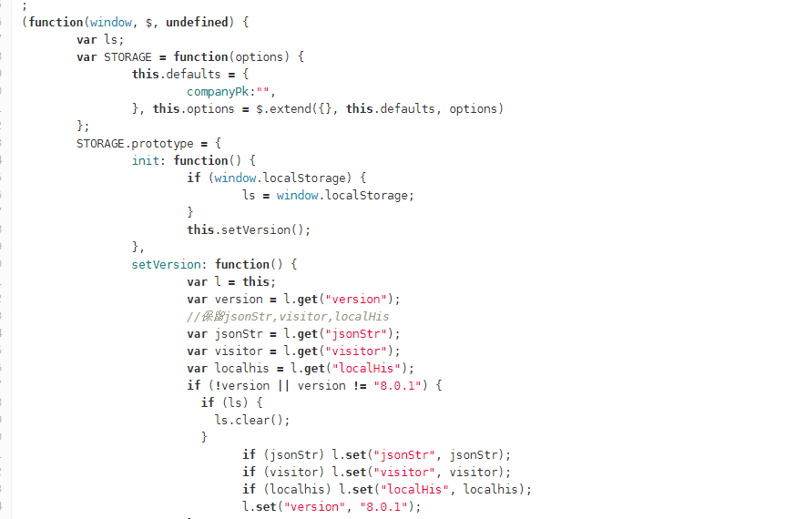
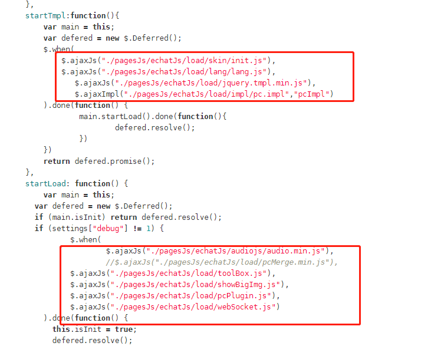

# 访客端
开发框架: jquery.1.7.2.min.js  
样例: [http://git.any800.com/gzcb/any800 ](http://git.any800.com/gzcb/any800)  develop分支  
目录: JtalkManager  
代码路径:JtalkManager\WebContent\pagesJs\echatJs\load  

#### 入口文件: 
pc访客端: 
/JtalkManager/WebContent/pagesJs/echatJs/load/pc.js  
h5访客端: 
/JtalkManager/WebContent/pagesJs/echatJs/load/h5.js  

#### 设计开发文档
参见 杂项/doc/ucc客户端设计文档-稳定版V1.0.doc  

#### 开发方式: 
1. 功能组件化,将不同的功能保存为组件  
    
2. 异步加载, 通过入口文件异步加载需要使用的js,css,impl(模板)文件  
    
3. 打包
  通过gulp打包将部分js文件合并(项目中暂不使用)  
  参见 杂项/gulp  

#### 流程图
参见 杂项/流程图/久科ucc产品流程图.pos  

#### 功能点
1. 机器人助手
2. 系统消息发送
3. 加载皮肤
4. 多语言初始化
5. 时间矫正(服务器时间与浏览器时间)
6. 图片展示浏览
7. 本地历史记录(历史记录)
8. 消息记录(消息去重)
9. 用户信息
10. 访问限制(有限分钟内仅能访问有限次)
11. 业务类型获取与展示
12. 是否超出工作时间
13. 敏感词提示
14. 图标切换(表情)
15. 初始化对话
16. 访客监控
17. 满意度规则(在关闭对话,并且用户有过一次以上留言打开满意度,已打开满意度将不再打开)
18. 缓存记录
19. webSocket(创建,监听消息,断线重连,消息回执,欢迎语等)
20. 输入框显示
21. 网络检测
22. 访客坐席超时提醒
23. 排队(排队信息,超时,超长,重新排队,取消排队)
24. 消息提示语(由服务端多语言获取)
25. 对话(开始结束对话,发送对话消息,发送机器人消息,接收消息,接收指令消息)
26. 机器人
27. 离线消息
28. 访客信息收集
29. 切换窗口(同一个浏览器中切换窗口仅能维持后一个打开的)
30. 拉伸控制(非对话区域点击无效)
31. H5中点击换行就发送
32. H5中离开对话提示
33. 音频转换
34. 滚动条置底/置顶
35. 业务类型点击判断(H5中发送消息需要判断是否跳转业务类型)
36. 微信下拉查看网址修复
37. 对话框点击修正(最多显示4行)
38. 发送后清空并聚焦输入框
39. 图片上传(先显示空白图片然后填充)
40. unload时需要调用切换窗口组件
41. PC右侧分栏
42. PC工具栏提示
43. PC样式修改
44. PC截屏插件
45. PC右键下载图片
46. 缓存图片
47. PC中点击回车就发送
48. PC保存对话记录到本地(通过jsp)
49. PC文件上传
50. PC粘贴图片或文本,光标修正
51. 文本发送时需要转换空格,换行,表情,敏感词
52. PC切换按键发送
53. PC标题闪烁
54. 广告(在对话开始前显示)
55. PC发送的链接在右侧分栏显示
56. 图片懒加载
57. H5替换setTimeout和setInterval

